## **Today’s goal**

By the end of this workshop you can:

-   Explain what **multivariate data** is!
-   Choose a method based on the Objective.
-   Run each method in **R** and interpret results

## **What is multivariate data?**

In a **Multivariate case** we observe multiple variables(responses) per unit.

**Example:**

-   a patient's health records tracking cholesterol, blood pressure, and weight
-   car data (MPG, horsepower, weight)
-   house features (size, bedrooms, price)
-   dataset assessing crop yield, Soil pH, Nitrogen Level, Irrigation Amount and Avg. Temperature

## **Univariate vs multivariate (quick picture)**

-   **Univariate**: one response (e.g., compare yield for different Soil pH levels)
-   **Multivariate**: multiple responses\
    (e.g., compare yield across different Soil pH levels, Nitrogen Levels, Irrigation Amounts, and Avg.) Temperature)

Multivariate methods help avoid: - running many separate tests - missing joint patterns

## **Why multivariate methods?**

::: notes
To see the big picture. The more variable the better it is.
:::

-   Many variables are **correlated**

-   We want **summary patterns**, **groups**, or **group differences** across several outcomes

## **Workflow checklist (always)**

1.  Identify the **Objective**
2.  Choose variables (numeric vs categorical)
3.  Clean data: missing values, outliers
4.  Decide whether to **standardize** (usually yes for PCA & clustering)
5.  Fit model + interpret output
6.  Communicate the results in simple words

## **Choosing technique based on objective**

<details name="my-lists">

<summary>**Predict or Explain**</summary>

-   Multiple Regression

-   Logistic Regression

-   Discriminant Analysis

</details>

<details name="my-lists">

<summary>**Reduce complexity (Dimension reduction)**</summary>

-   [Principal Component Analysis (PCA)](#PCA){style="color: red;"}

-   Factor Analysis (FA)

</details>

<details name="my-lists">

<summary>**Find Groups (unsupervised learning)**</summary>

-   [Cluster Analysis (CA)](#CA){style="color: red;"}

-   Multidimensional Scaling

</details>

<details name="my-lists">

<summary>**Understand relationships between sets of variables**</summary>

-   Canonical Correlation Analysis (CCA)

-   Structural Equation Modeling

</details>

<details name="my-lists">

<summary>**Compare groups on multiple outcomes**</summary>

-   Multivariate Analysis of Variance (MANOVA)

</details>

## **PCA** {#PCA}

::: notes
"In the next 2 minutes, I'm going to show you how PCA can take complex agricultural data and make it simple enough to understand at a glance. Let's dive in!" TIMING: 10 seconds
:::

**A statistical technique that transforms correlated variables into a smaller set of uncorrelated variables called principal components.**

::: notes
Imagine a pencil • Side view: Long & detailed • End view: Just a circle

PCA finds the "side view" The angle that shows the most variation and information
:::

### Why use PCA

::::: {.columns style="font-size: .8em;"}
::: {.column width="50%"}
-   Dimensionality Reduction

-   Remove Redundancy

-   Feature Engineering
:::

::: {.column width="50%"}
-   Data Visualization

-   Noise Reduction

-   Speed up Analysis
:::
:::::

### When to use PCA

::::: {.columns style="font-size: 0.7em;"}
::: {.column width="50%"}
[**Good Scenarios:**]{style="color: Green;"}

1.  Many correlated variables (r \> 0.7)
2.  Need to visualize complex data
3.  All variables are numeric/continuous
4.  Variables measured on similar scales
5.  Exploratory data analysis
6.  Pre-processing for ML models
:::

::: {.column width="50%"}
[**Not Recommended When:**]{style="color: red;"}

1.  Variables are independent (not correlated)
2.  Need to interpret original variables
3.  Categorical/binary variables only
4.  Small sample size (n \< 50)
5.  Missing data is widespread
6.  Variables on very different scales (unless standardized)
:::
:::::

::: {aside}
**Tip:** Check correlation matrix first! If most correlations \< 0.3, PCA may not help much.
:::

## **CA** {#CA}

**Cluster Analysis is an unsupervised method that groups observations** (fields, farms, samples, people) so that:

::: {.columns style="font-size: 0.75em;"}
-   items within the same cluster are similar, and

-   items in different clusters are different

based on the variables chosen (usually numeric variables).
:::

### Why use CA

::: {.columns style="font-size: 0.8em;"}
-   discover types/profiles in your data (e.g. “field types”)

-   simplify a complex dataset into a few understandable groups

-   support decision-making (e.g., “these fields behave similarly, manage them similarly”)

-   identify unusual observations (outliers often show up as small or isolated clusters)
:::

### When to use CA

::: {.columns style="font-size: 0.7em;"}
-   do not have labeled groups already (no “true classes”)

-   have several variables and suspect there are hidden patterns

-   goal is exploration: “What kinds of observations exist here?”
:::

## **Example**

We’ll use a dataset:

::: notes
We have data from 180 agricultural fields across a few Nebraska counties. For each field we recorded soil test results (N, P, K, pH, organic matter, clay %, soil moisture), a vegetation index (NDVI) from imagery during the growing season, and the end-of-season yield. We also have field characteristics like crop type, irrigation type, and management (conventional vs cover crop). The goal is to use multivariate methods to summarize soil + vegetation conditions and find field types.
:::

-   We have data from 180 agricultural fields across a few Nebraska counties.

-   For each field, we recorded soil test results (N, P, K, pH, organic matter, clay %, soil moisture), a vegetation index (NDVI) from imagery during the growing season, and the end-of-season yield. We also have field characteristics like crop type, irrigation type, and management (conventional vs cover crop).

-   The goal is to use multivariate methods to summarize soil + vegetation conditions and find field types.

## **Loading data in R**

```{r}
url <- "https://raw.githubusercontent.com/aftabsorwar/STAT-930-workshop/refs/heads/main/multivariate_workshop_dataset.csv"
dat <- read.csv(url)

# Save `dat` into your current working directory
write.csv(dat, file = "multivariate_workshop_dataset.csv", row.names = FALSE)

# (Optional) check where it was saved
getwd()

# make group variables factors
dat$Crop <- factor(dat$Crop)
dat$Management <- factor(dat$Management)

# Quick look
str(dat)
head(dat)
```

::: {.columns style="font-size: .8em;"}
Short description of the variable:

-   **FieldID:** Unique ID for each field.

-   **Crop:** Crop type grown *(Corn / Soybean / Wheat)*.

-   **Management:** Practice type *(Conventional vs CoverCrop)*.

-   **SoilN:** Soil nitrogen level (mg/kg). *Higher often means more available nitrogen for plants.*

-   **SoilP:** Soil phosphorus level (ppm). *Supports root development and early growth.*

-   **OrgMatter:** Organic matter (%). *A soil health indicator. Improves fertility and water-holding capacity.*

-   **Moisture:** Soil moisture (%). *Amount of water in the soil.*

-   **NDVI:** A satellite/drone-based vegetation index (0–1) that measures how green the crop is. *Larger values generally mean more plant biomass and stronger vegetation cover.*
:::

## **PCA in R**

```{r}
# Create a vector of the numeric column names we want for PCA
num_vars <- c("SoilN", "SoilP", "OrgMatter", "Moisture", "NDVI")

# Create a numeric-only data frame X containing just those variables
X <- dat[,num_vars]
X
# Confirm that X contains only numeric columns
str(X)

# Count missing values in each column
colSums(is.na(X))
```

```{r}
# Calculate correlation matrix
cor_matrix <- cor(X)
print(round(cor_matrix, 2))

# Visualize correlations
# install.packages("corrplot")
library(corrplot)

corrplot(cor_matrix, 
         method = "color", 
         type = "upper",
         addCoef.col = "black", 
         number.cex = 0.7,
         tl.col = "black", 
         tl.srt = 45,
         title = "Correlation Matrix: Field Variables",
         mar = c(0, 0, 2, 0))
```

```{r}
# Fit PCA using prcomp:
# center=TRUE subtracts the mean
# scale.=TRUE divides by standard deviation (standardizes variables)
pca_fit <- prcomp(X, center = TRUE, scale. = TRUE)

# Print a basic summary of the PCA result
summary(pca_fit)
```

::: {.columns style="font-size: .7em;"}
PC1 and PC2 are new summary variables created by PCA.

They are made from your original variables, but they are designed to:

1.  Summarize the data with fewer dimensions

2.  Capture the biggest patterns in the data

    a.PC1 captures the largest overall variation (the main trend).

    b.PC2 captures the second-largest variation, separate from PC1.

3.  these 2 are uncorrelated (i.e. PC2 is built so it does not repeat what PC1 already explains.)
:::

```{r}
# pca_fit$sdev contains the standard deviations of each principal component
# Squaring gives variance of each PC
pc_var <- pca_fit$sdev^2

# Convert to percentage of variance explained (PVE)
pve <- pc_var / sum(pc_var)
pve_pct <- pve*100
pve_pct <- round(pve_pct, 3)
pve_pct
cumulative_pve_pct <- cumsum(pve_pct)
cumulative_pve_pct
```

::: {.columns style="font-size: .8em;"}
PC1 explains 55%, PC2 explains 22%. Together about 78% of the variation
:::

```{r}
# Plot proportion variance explained for each PC
plot(pve, type = "b",
     xlab = "Principal Component",
     ylab = "Proportion of Variance Explained")
```

```{r}
# Show loadings for the first two PCs
round(pca_fit$rotation[, 1:2], 3)
```

::: {.columns style="font-size: .7em;"}
A loading is a correlation-like weight, so its value is between −1 and +1

What the size means

-   Close to +1 or −1 → strong contribution of that variable to the PC

-   Close to 0 → little contribution

-   The sign does not matter, magnitude matters.
:::

::: {.columns style="font-size: .7em;"}
For our example:

-   PC1 mainly represents a “soil fertility / soil health”.
    -   Fields differ on PC1 mostly because of SoilN, SoilP, and organic matter.
-   PC2 mainly represents a “water + crop greenness”.
    -   Fields differ on PC2 mostly because of soil moisture and NDVI.
:::

```{r}
biplot(pca_fit,
       cex = 0.6,        # point/label size
       scale = 0,        # keeps interpretation simple
       xlabs = rep(".", nrow(X)))  # hides observation labels (too crowded)

```

##### check pc2 & pc3

```{r}
# Show loadings for the first 3 PC's
round(pca_fit$rotation[, 1:2], 3)

biplot(pca_fit,
       choices = c(2,3),
       cex = 0.6,        # point/label size
       scale = 0,        # keeps interpretation simple
       xlabs = rep(".", nrow(X)))  # hides observation labels (too crowded)

```

::: notes
Blue dots = individual fields (each point is one field)

Red arrows = your original variables (SoilN, SoilP, OrgMatter, Moisture, NDVI)

PC1 (x-axis) and PC2 (y-axis) are the two main PCA directions
:::

::: {.columns style="font-size: .7em;"}
This biplot shows that PC1 mainly reflects soil fertility (SoilN, SoilP, OrgMatter), while PC2 mainly reflects moisture and crop greenness (Moisture, NDVI). Fields spread along these two gradients.

-   A field located toward the left tends to have higher SoilN/SoilP/OrgMatter

-   A field located higher up tends to have higher Moisture and NDVI

-   Fields near the center are closer to average on all variables
:::

## **CA in R**

```{r}
# Standardize to mean 0 and sd 1
X_scaled <- scale(X)


# Elbow method: try k from 1 to 8
set.seed(930)
wss <- numeric(8)

for (k in 1:8) {
  km <- kmeans(X_scaled, centers = k, nstart = 25)
  wss[k] <- km$tot.withinss
}
```

```{r}
plot(1:8, wss, type = "b",
     xlab = "Number of clusters (k)",
     ylab = "Total within-cluster sum of squares")

```

```{r}
set.seed(930)
km3 <- kmeans(X_scaled, centers = 3, nstart = 25)

# Add cluster labels to the dataset
dat$Cluster <- factor(km3$cluster)

# How many fields per cluster?
table(dat$Cluster)

```

```{r}
# Cluster means (interpretation table)
cluster_means <- aggregate(X, by = list(Cluster = dat$Cluster), mean)
cluster_means

```

```{r}
# PCA only for plotting (not required for clustering)
pca <- prcomp(X_scaled, center = FALSE, scale. = FALSE)
scores <- as.data.frame(pca$x[, 1:2])

plot(scores$PC1, scores$PC2,
     pch = 19,
     xlab = "PC1", ylab = "PC2",
     main = "PCA space (without cluster)")

plot(scores$PC1, scores$PC2,
     col = dat$Cluster, pch = 19,
     xlab = "PC1", ylab = "PC2",
     main = "Clusters shown in PCA space")
legend("topright", legend = levels(dat$Cluster),
       col = 1:length(levels(dat$Cluster)), pch = 19)

```

::: notes
Points with the same color are grouped as similar field profiles. Separation means clusters differ.
:::

::: {.columns style="font-size: .7em;"}
Clustering helps us find field types without a response variable. Then we summarize each cluster using the mean soil and NDVI values to create an interpretable story.
:::

## **Loading data in SAS**

``` sas
/* Read the CSV directly from GitHub */
filename myurl url "https://raw.githubusercontent.com/aftabsorwar/STAT-930-workshop/refs/heads/main/iris.csv";

proc import datafile=myurl
    out=iris
    dbms=csv
    replace;
    guessingrows=max;
run;

/* Quick look */
proc contents data=iris;
run;

proc print data=iris(obs=5);
run;
```

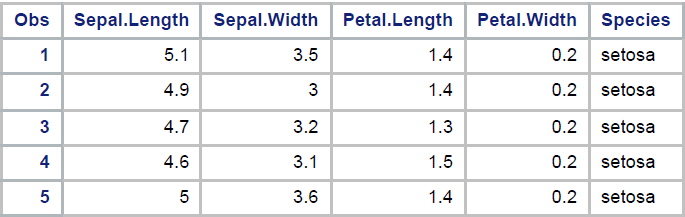{width="600"}


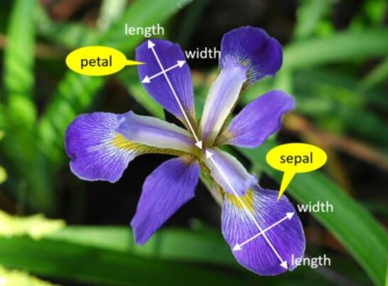

::: {.columns style="font-size: .5em;"}
This flower figures were uploaded by [Gayan_De_Silva](https://www.researchgate.net/profile/Gayan_De_Silva2)
:::

## **PCA in SAS**

#### Correlation Matrix

``` sas
/* Correlation Heatmap */
ods graphics on;

proc corr data=iris nosimple noprob plots=matrix(histogram);
   var "Sepal.Length"n 
       "Sepal.Width"n 
       "Petal.Length"n 
       "Petal.Width"n;
run;

ods graphics off;
```

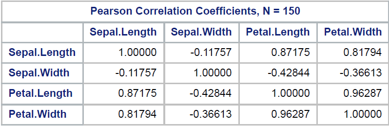

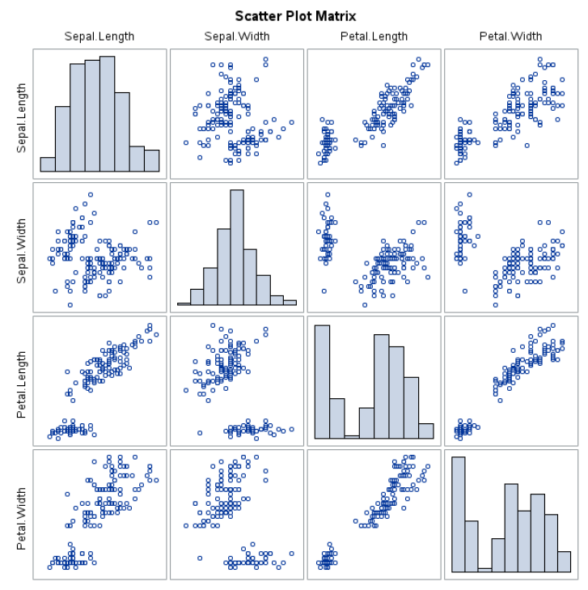{width="800"}

::: {.columns style="font-size: .7em;"}
-   **Petal.Length & Petal.Width = 0.9629** → extremely strong positive correlation

-   **Sepal.Length strongly correlated with petal variables** (≈ 0.82–0.87)

-   **Sepal.Width negatively correlated** with the others
:::

#### PCA {#pca}

``` sas
/* PCA */
ods graphics on;

proc princomp data=iris
              out=iris_pca_scores
              outstat=iris_pca_stat
              std
              plots=scree;
   var "Sepal.Length"n "Sepal.Width"n "Petal.Length"n "Petal.Width"n;
run;

ods graphics off;
```

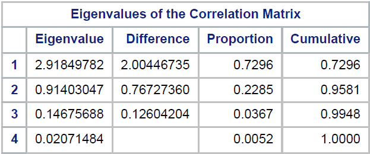{width="600"}

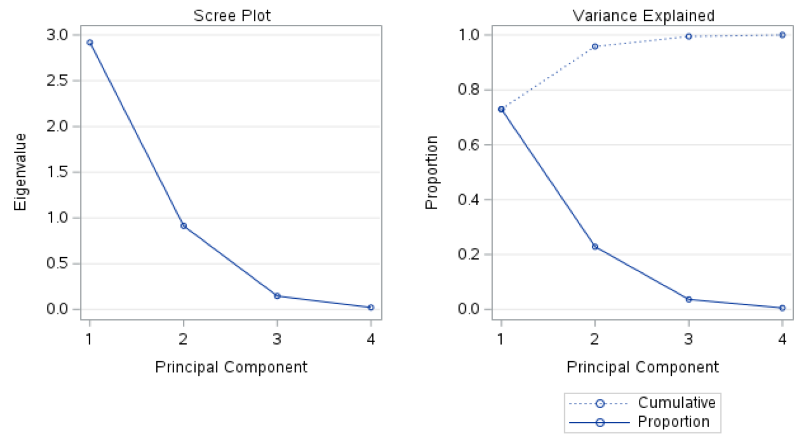{width="800"}

::: {.columns style="font-size: .7em;"}
-   PC1 explains \~73% of total variation → very dominant.

-   PC1 + PC2 explain \~96% → two components are enough.

-   PC3 and PC4 contribute almost nothing.

So dimension can be reduced from 4 variables → 2 components safely.
:::

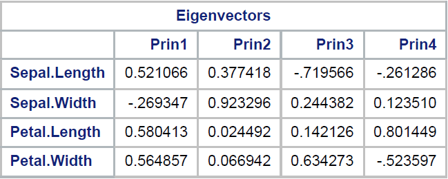{width="600"}

::: {.columns style="font-size: .7em;"}
For PC1:

-   Strong positive loadings for **petal variables**

-   Moderate positive loading for Sepal.Length

-   Negative for Sepal.Width

PC1 represents **overall flower size (especially petal size)**.
:::

::: {.columns style="font-size: .7em;"}
For PC2:

-   Dominated by **Sepal.Width**

-   Almost no contribution from petal variables

PC2 represents **sepal width variation independent of petal size**.
:::

#### Bi-plot

``` sas
ods graphics on;
proc princomp data=iris plots=(patternplot score(ncomp=2));
    var "Sepal.Length"n "Sepal.Width"n "Petal.Length"n "Petal.Width"n;
    title "PCA – Biplot (Pattern + Score Plot)";
run;
ods graphics off;
```

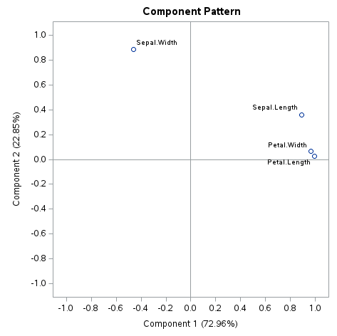{width="600"}

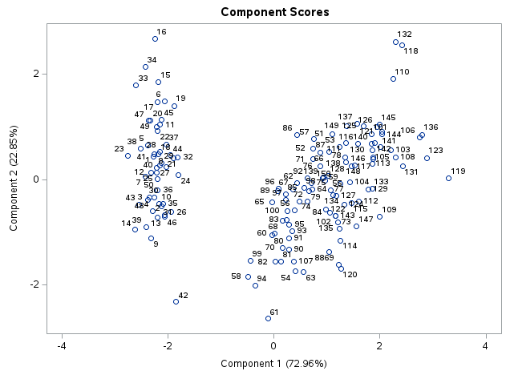{width="800"}

``` sas
proc sgplot data=iris_pca_scores;
   scatter x=prin1 y=prin2 / group=Species;
   xaxis label="PC1";
   yaxis label="PC2";
   title "PCA of Iris Data";
run;
```

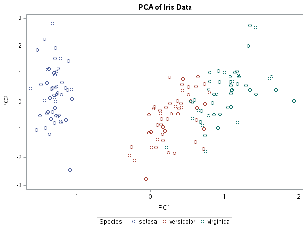{width="799"}

## **CA in SAS**

``` sas
/* Standardize the numeric variables */
proc standard data=iris mean=0 std=1 out=iris_z;
   var "Sepal.Length"n "Sepal.Width"n "Petal.Length"n "Petal.Width"n;
run;

/* To see first 5 observation */
proc print data=iris_z(obs=5);
run;
```

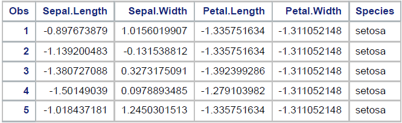{width="600"}

::: {.columns style="font-size: .7em;"}
We need to find optimum number of cluster to be considered for this analysis.
:::

``` sas
/* Elbow method (within-cluster variation) */
%macro elbow(maxk=6);

data elbow_results;
  length k 8 wcss 8;
  stop;
run;

%do k=1 %to &maxk;

   /* Run k-means and save per-observation distance to its cluster center */
   proc fastclus data=iris_z maxclusters=&k maxiter=100 out=clusout noprint;
      var "Sepal.Length"n "Sepal.Width"n "Petal.Length"n "Petal.Width"n;
   run;

   /* Compute WCSS = sum(distance^2) */
   data clusout2;
      set clusout;

      /* FASTCLUS usually creates DISTANCE. Some versions use _DIST_. */
      dist = coalesce(DISTANCE, _DIST_);
      dist2 = dist*dist;
   run;

   proc sql noprint;
      select sum(dist2) into :wcss from clusout2;
   quit;

   data temp;
      k = &k;
      wcss = &wcss;
   run;

   proc append base=elbow_results data=temp force;
   run;

%end;

%mend;

%elbow(maxk=6);


/* To see first 5 observation */
proc print data=clusout(obs=5);
run;
```

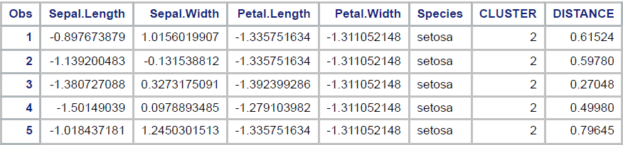

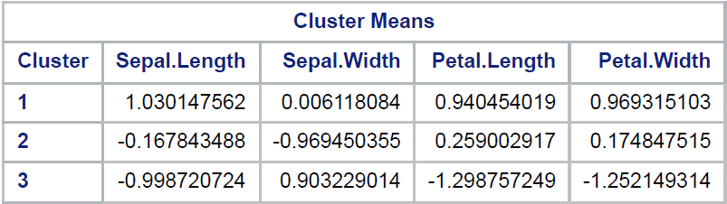{width="600"}

``` sas
/* Elbow plot */
proc sgplot data=elbow_results;
   series x=k y=wcss / markers;
   xaxis label="Number of clusters (K)" integer;
   yaxis label="WCSS (sum of squared within-cluster distances)";
   title "Elbow Plot (Iris)";
run;
```

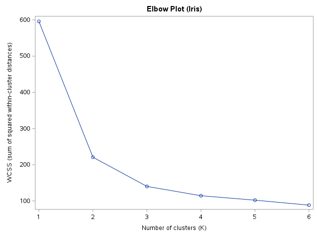{width="800"}

::: {.columns style="font-size: .7em;"}
Proceed with the optimum cluster
:::

``` sas
/* Run K-means (K=3) */
proc fastclus data=iris_z maxclusters=3 maxiter=100 out=iris_k3;
   var "Sepal.Length"n "Sepal.Width"n "Petal.Length"n "Petal.Width"n;
run;
```

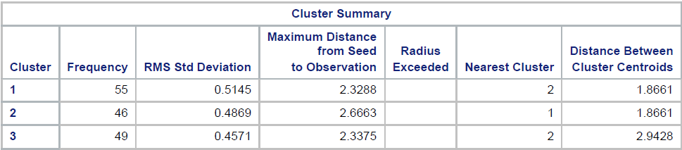{width="800"}

``` sas
/* plotting the clusters */
proc princomp data=iris_z out=iris_pca std;
   var "Sepal.Length"n "Sepal.Width"n "Petal.Length"n "Petal.Width"n;
run;

/* Combine cluster labels with PCA scores */
data iris_pca_cluster;
   merge iris_pca iris_k3(keep=cluster);
run;

/* To see first 5 observation */
proc print data=iris_pca_cluster(obs=5);
run;
```

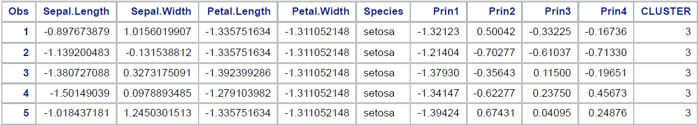{width="800"}

``` sas
proc sgplot data=iris_pca_cluster;
   scatter x=prin1 y=prin2 / group=cluster;
   xaxis label="PC1";
   yaxis label="PC2";
   title "K-means Clusters on PCA Space";
run;
```

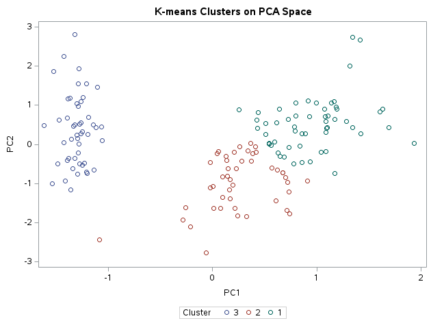{width="800"}
